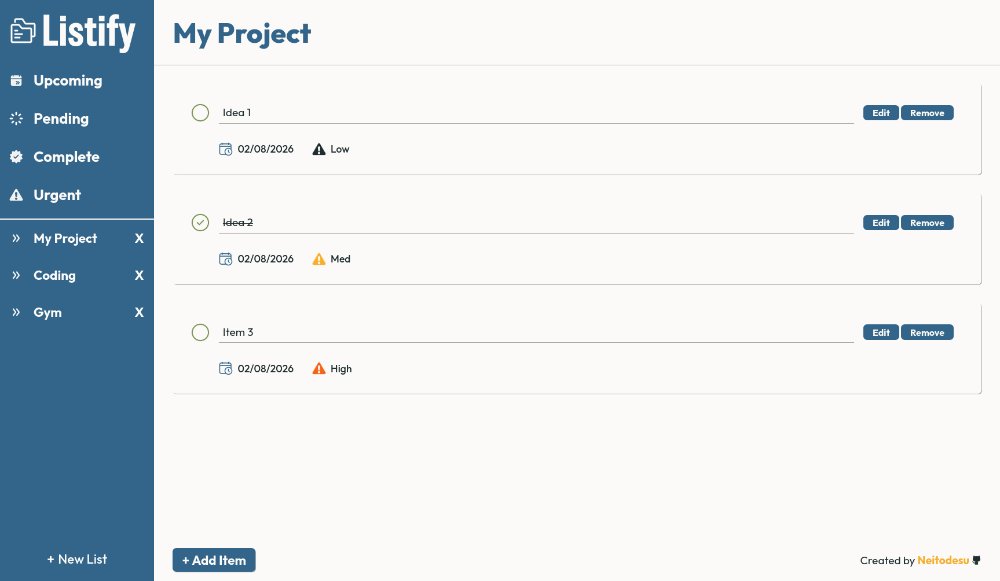
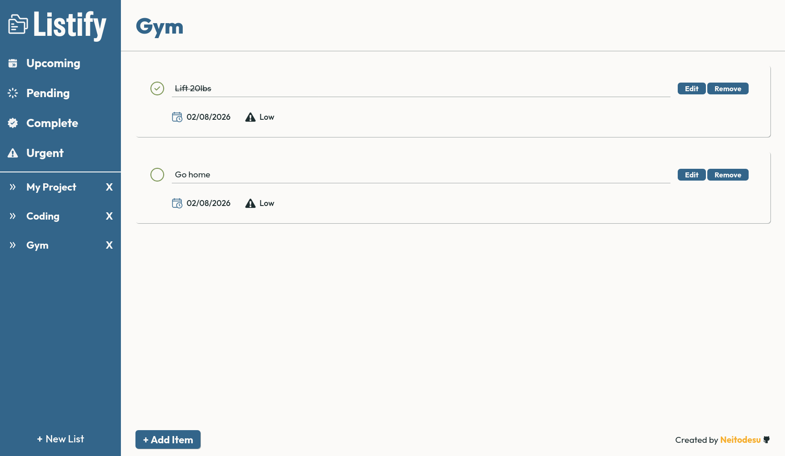
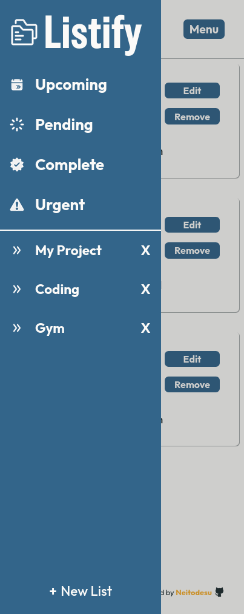
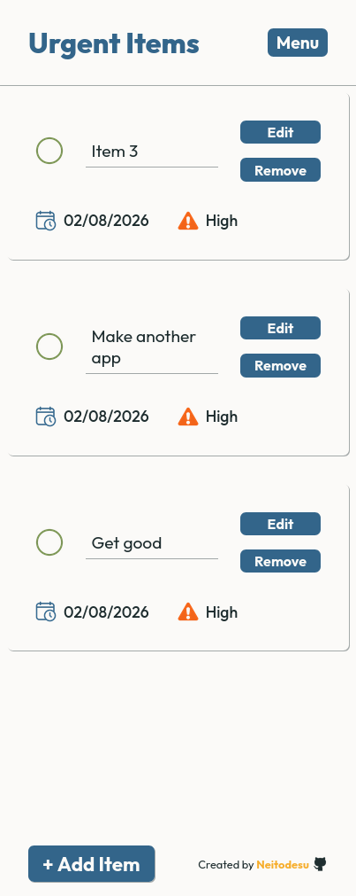

# Listify

[Live Link](https://neitodesu.github.io/odin-listify/)

### <u>Tools used</u>

### Project Targets:

- View all projects
- View all todo's per project
- Edit/remove todo's
- Uses date-fns library which was pretty neat and made things way easier working with the dates
- Uses localStorage

### Desktop View

### Mobile View

